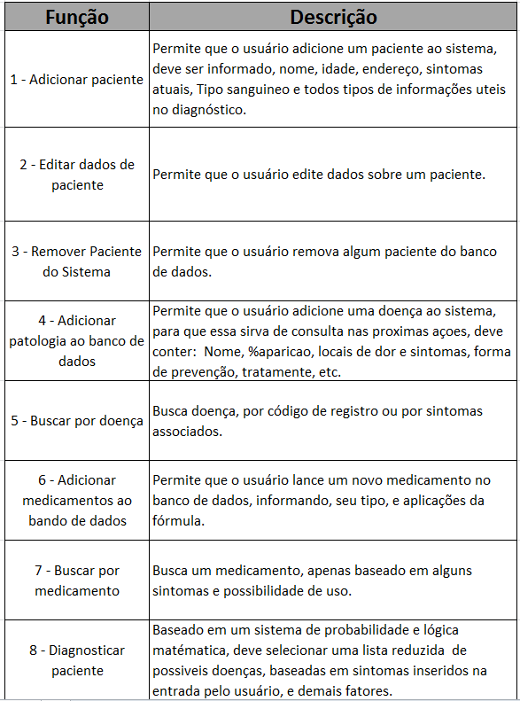

	
	 
	 
	 

	<a href="awesome.md">What is an awesome list?</a>&nbsp;&nbsp;&nbsp;
	<a href="contributing.md">Contribution guide</a>&nbsp;&nbsp;&nbsp;
	<a href="create-list.md">Creating a list</a>&nbsp;&nbsp;&nbsp;
	<a href="https://twitter.com/awesome__re">Twitter</a>&nbsp;&nbsp;&nbsp;
	<a href="https://www.redbubble.com/people/sindresorhus/works/30364188-awesome-logo">Stickers & t-shirts</a>

 

	<b>Follow the <a href="https://twitter.com/awesome__re">Awesome Twitter account</a> for updates on new list additions.</b>

 

	Just type <a href="https://awesome.re"><code>awesome.re</code></a> to go here. Check out my <a href="https://blog.sindresorhus.com">blog</a> and follow me on <a href="https://twitter.com/sindresorhus">Twitter</a>.

 

# WEB_PROJECT_P3

Link -> [https://projeto-js-cdf7e.firebaseapp.com](https://projeto-js-cdf7e.firebaseapp.com)
        ou [https://projeto-js-cdf7e.web.app](https://projeto-js-cdf7e.web.app)

## Descrição

Desenvolvido sistema de inserção de pacientes, doenças e medicamentos, com intuito de gerir as combinações entre os elementos e gerar um algoritmo simples de "diagnóstico". Basicamente, foi desenvolvido com JAVA-SCRIPT, CSS, HTML E JQUERY.
A tabela abaixo explica de maneira mais específica as funções do site.

        

  

Dúvidas = mffsp@ic.ufal.br
